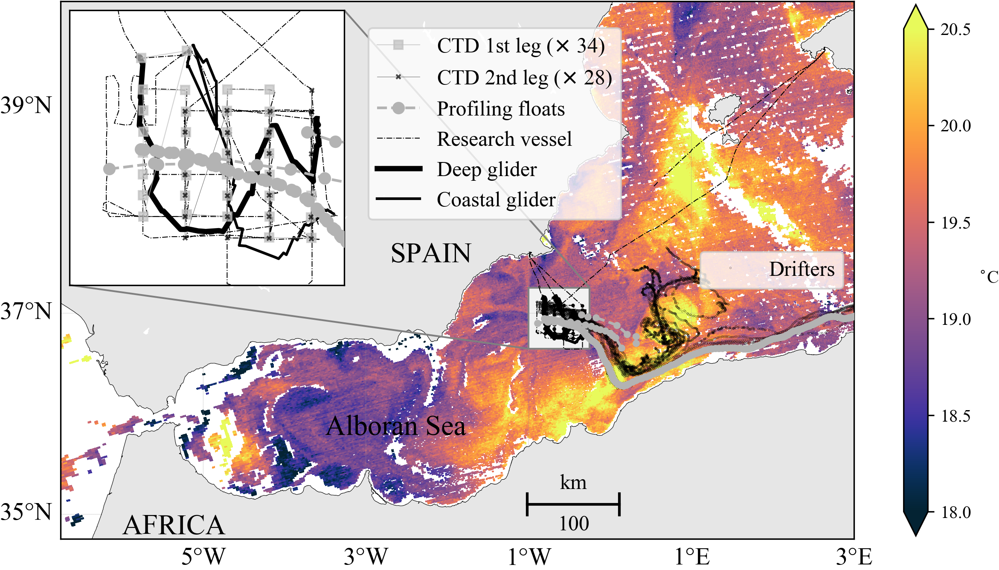

 
        
[](https://doi.org/10.5281/zenodo.2538348)

This repository contains the python code in the form of [Jupyter](https://jupyter.org/) notebooks to reproduce the figures of the paper:

> Troupin, C.; Pascual, A.; Ruiz, S.; Olita, A.; Casas, B.; Margirier, F.; Poulain, P.-M.; Notarstefano, G.; Torner, M.; Fernández, J. G.; Rújula, M. Muñoz, C.; Allen, J. T.; Mahadevan, A. & Tintoré, J. (2019). The AlborEX dataset: sampling of submesoscale features in the Alboran Sea, _Earth System Science Data Discussions_, __11 (1)__: 129–145. DOI: [10.5194/essd-11-129-2019](https://doi.org/10.5194/essd-11-129-2019)

and to provide examples of the data from the netCDF files can be read, processed and displayed.



## Directories

* __data__: contains data files used for the plots and not available through [OPeNDAP](https://www.opendap.org/) protocol.

* __figures__: default directory where the figures are saved.

* __leaflet__: contains the source (html) to generate a [Leaflet](https://leafletjs.com/) interactive map showing the deployments and the sea surface temperature in the area of study.

* __python__: contains
1. the main module [`alborexdata.py`](./python/alborexdata.py) that defines the different classes
2. the jupyter notebooks and

## Usage

### Configuration

The file [`alborexpaths.py`](./python/alborexpaths.py) stores the OPEnDAP URLs of all the data files (so they don't have to be downloaded locally), the extension of the domain and the path to the figure directory.

__Note:__ the URLs were hard-coded but can be obtained using the [SOCIB Data API](http://api.socib.es/home/) (see the [API Examples](https://github.com/socib/API_examples)).

The SST files are not available in this repository but are automatically download from [OceanColor](http://oceancolor.gsfc.nasa.gov/) web when needed.

### Reading files

Each platform (drifters, Argo floats, gliders, ...) has a class defined in [`alborexdata.py`](./python/alborexdata.py), and the corresponding class has a method to read the data from the netCDF file.

For example, for the CTD data:
1. We create an object CTD:
```python
ctd = alborexdata.CTD()
```
2. We read the data from the correspond files, whose URL comes from `alborexpaths`:
```python
ctd.get_from_netcdf(alborexpaths.ctdfile)
```

### Plotting data

There are many different types of plots used here.     
For the maps, we used the [Basemap Toolkit](https://matplotlib.org/basemap/) but in the future we will switch to [Cartopy](https://scitools.org.uk/cartopy/docs/latest/), once all the Basemap's features have been implemented.

We also work with the [cmocean](https://matplotlib.org/cmocean/) module in order to obtain perceptually uniform colormaps.

## How to cite?

This module:

> Charles Troupin. (2019, January 12). ctroupin/AlborEx-Data-Python: V1.1.0 (Version V1.1.0). Zenodo. DOI: [10.5281/zenodo.2538348](http://doi.org/10.5281/zenodo.2538348)

The AlborEx paper in [Earth System Science Data](https://www.earth-system-science-data.net/) (the reference will be updated):

> Troupin, C.; Pascual, A.; Ruiz, S.; Olita, A.; Casas, B.; Margirier, F.; Poulain, P.-M.; Notarstefano, G.; Torner, M.; Fernández, J. G.; Rújula, M. Muñoz, C.; Allen, J. T.; Mahadevan, A. & Tintoré, J. The AlborEX dataset: sampling of submesoscale features in the Alboran Sea. *Earth System Science Data Discussions*, 2018, 1-21. DOI: [10.5194/essd-2018-104](https://doi.org/10.5194/essd-2018-104)

Other related papers:

> Pascual, A.; Ruiz, S.; Olita, A.; Troupin, C.; Claret, M.; Casas, B.; Mourre, B.; Poulain, P.-M.; Tovar-Sanchez, A.; Capet, A.; Mason, E.; Allen, John T..; Mahadevan, A. & Tintoré, J. A multiplatform experiment to unravel meso- and submesoscale processes in an intense front (AlborEx). *Frontiers in Marine Science*, 2017, **4**, 1-16. DOI: [10.3389/fmars.2017.00039](https://doi.org/10.3389/fmars.2017.00039)

> Olita, A.; Capet, A.; Claret, M.; Mahadevan, A.; Poulain, P. M.; Ribotti, A.; Ruiz, S.; Tintoré, J.; Tovar-Sánchez, A. & Pascual, A. Frontal dynamics boost primary production in the summer stratified Mediterranean Sea. *Ocean Dynamics*, 2017, **67**, 767-782. DOI: [10.1007/s10236-017-1058-z](https://doi.org/10.1007/s10236-017-1058-z)


## Acknowledgments

The 3 anonymous reviewers made an outstanding work with a lot of comments that helped us improve
the initial manuscript, and also motivated me to improve and update the present project.

I am also thankful to the SOCIB Data Center for corrections and improvements made on the
data file. Their [Data API](http://api.socib.es/home/) is very cool and I really invite everybody to try and use it.  
